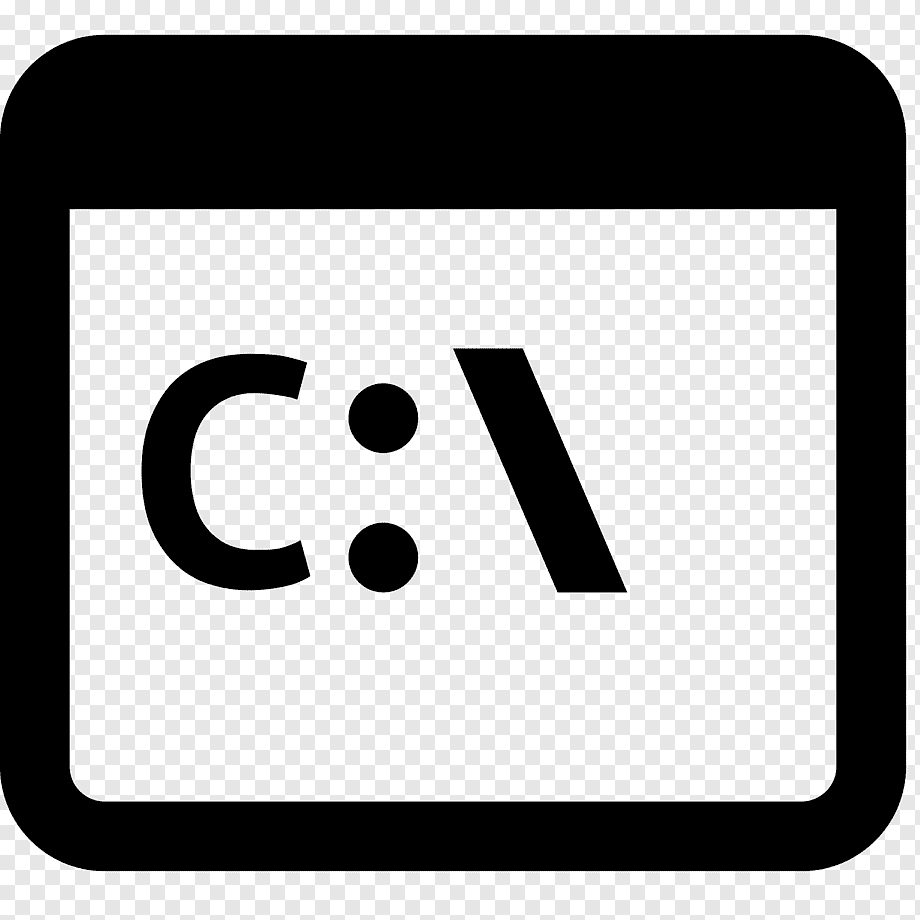

# Проект по автоматизации тестирования API для веб-приложения [Reqres](https://reqres.in/)

##  Покрытый функционал

> Разработаны автотесты на <code>API</code>.

### API

- [x] Запрос <code>POST</code>
- [x] Отображение <code>statusCode</code> и <code>body</code> в ответе запроса

##  Технологический стек

<p align="center">


</p>

> В данном проекте автотесты написаны на <code>Java</code> с использованием библиотеки <code>REST Assured</code> для API-тестов.
>
> Для автоматизированной сборки проекта используется <code>Maven</code>.
>
> В качестве библиотеки для модульного тестирования используется <code>Cucumber</code>.
>
> Отчет генерируется с помощью библиотеки <code>Allure</code>.

##  Запуск тестов из терминала

###  Локальный запуск тестов

```
mvn clean test - запуск всех тестов в проекте
```
```
mvn clean test -Dgrops="@jsonPotato" - запуск теста jsonPotato

mvn clean test -Dgrops="@RickMorty" - запуск теста RickMorty
```